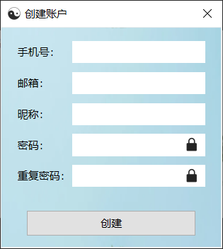

# secrets-manage

<br/>
<br/>

<p align="center">
    <br/>
    <a href="https://github.com/dreaming-coder" alt="Author">
        
    </a>
    &nbsp;
    
    &nbsp;
    
    &nbsp;
    
    &nbsp;
    

</p>

<br>


这是学习 PySide 6 后编写的第一个完整的项目， 动机就是因为各种各样的系统太多，账号密码记不过来。用文档记又有泄露的风险，而且这个需求说大不大、说小不小，正好最近在学
PySide 6，干脆自己动手写一个了。

这个项目比较简单，应该算把基本的用法都囊括了，算是很好的入门吧，希望给同样在学 Qt 编程的人有所帮助。

## 功能

- [x] 多用户使用
- [x] 数据本地化管理
- [x] AES 加密

## 项目依赖

- [x] Python == 3.11.0
- [x] PySide 6 ~= 6.5.1.1
- [x] cryptography ~= 1.0.3
- [x] Nuitka ~= 1.7.8

## 项目结构

```
-secrets-manage
    |-app.py         # 主程序入口
    |-conf\          # 配置文件
    |-dao\           # 数据库相关
    |-entity\        # 实体类
    |-resources\     # 静态资源文件
    |-script\        # 脚本
    |-utils\         # 工具类
```

## 使用说明

- 手机号只做了 11 位数字的正则校验，避免新增号段匹配失败
- 电子邮箱正则表达式为 `^\w+([-+.]\w+)*@\w+([-.]\w+)*\.\w+([-.]\w+)*$`
- 密码限制首字母必须是数字，正则表达式为 `^[a-zA-Z][\w!@#$%^&*_]{5,17}$`

## 运行截图
<div class="half" style="text-align: center;">
    
    <br><br><br>
    
    <br><br><br>
    
    <br><br><br>
    
    <br><br><br>
    
    <br><br><br>
    
</div>


## donate
<div class="half" style="text-align: center;">
    
</div>